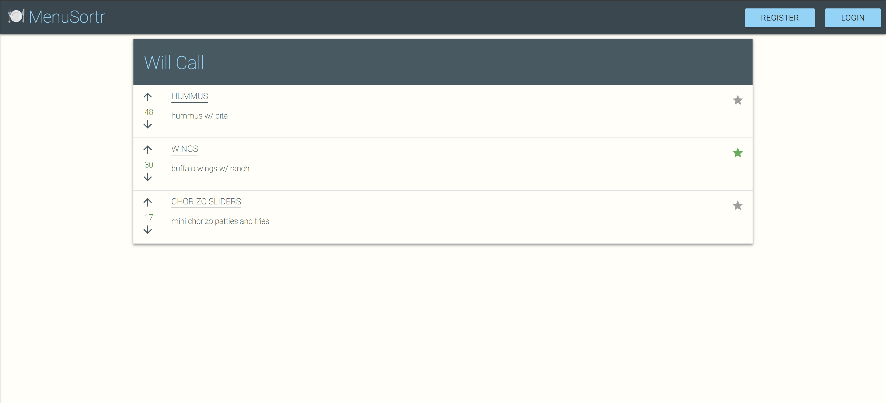

# :fork_and_knife: MenuSortr

MenuSortr is a food app designed to highlight the information user's want to find. Most food apps provide an opportunity to complain and criticize, and if there is something good to glean, you have to wade through all of the bad reviews or try to interpret ambiguous 5 star reviews. MenuSorter ranks restaurants and menu items in an ordinal manner based on user voting. Like Reddit, this allows users to find pertinent details about what they are looking at, namely what's popular, what's trending, and what isn't worth their time.

## Technologies used
* HTML5
* CSS3
* ReactJS
* Styled Components
* React-materialize
* Urql
* Firebase
* graphQL
* Node
* Express
* MongoDB
* Heroku
### Live link

[MenuSortr Live Demo](https://menu-sort.firebaseapp.com/)

## Contributing
Pull requests are welcome. For major changes, please open an issue first to discuss what you would like to change.

Thanks for checking out my project!
 
## Author

------------- |:-------------:|
col 3 is      | right-aligned |
col 2 is      | centered      |
zebra stripes | are neat      |
